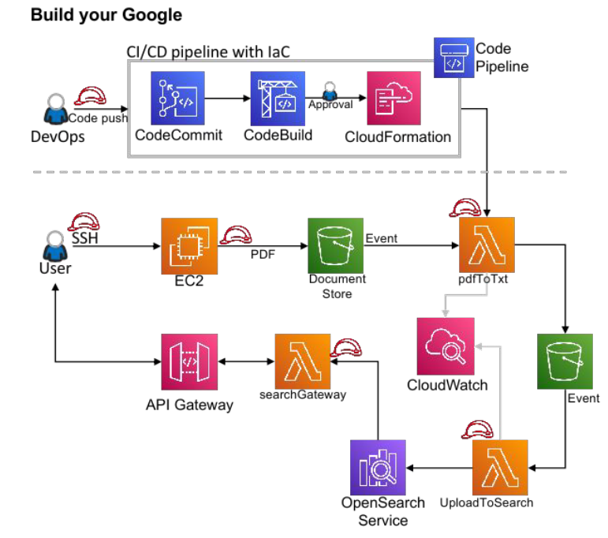

# PGPCC | Project -  Deploying a search engine using AWS Managed Services
_"The material shared in this document is proprietary. It is not to be distributed or shared except with the individual with whom it was directly sent."_

## Prelude
Search engines essentially act as filters for the wealth of information available on the internet. They allow users to quickly and easily find information that is of genuine interest or value, without the need to wade through numerous irrelevant web pages.

There is a lot of filtering to do - a few years ago the number of pages in Google's index exceeded the number of people on the planet, reaching a staggering figure of more than 8 billion. With that much content out there, the internet would be essentially unworkable without search engines, and internet users would drown in a sea of irrelevant information and shrill marketing messages.

## Context
Data, both structured and unstructured, is constantly increasing. Companies that are able to make the most use of their data will have a competitive edge. Finding the appropriate content in a timely manner has an effect on productivity and results in many businesses. Is your search strategy reliable enough to support knowledge discovery and provide a positive user experience?

By having an effective search implementation, enterprises can improve the productivity of their staff, customers, and partners. It also makes it easier to collaborate and take advantage of market opportunities. This exercise will help in understanding a process to setup the search infrastructure which will enable your team to concentrate more on their strategic objectives. 
Furthermore, a high-performing search application can result in a significant return on investment.

You will be working on a situation that replicates a company with significant amounts of data (pdf files) who are having difficulty finding the most pertinent documents.

## Architecture
 

## What are you expected to do?
### Steps for implementation

A.	Create an AWS Opensearch domain

B.	Download the deployment package files for the 4 Lambda functions provided along with this document on Olympus. 

C.	Deploy these packages on CodePipeline using the SAM and buildspec files provided in the zipped package files after configuring the Lambda functions. 

D.	Set up triggers for each of the Lambda functions created in the previous step

E.	Set up an API Gateway to access the Opensearch domain via the Lambda function ‘search-gateway’

F.	Upload the sample PDF file provided into the S3 bucket document store to chain-trigger the Lambda functions
 
## Configuring Opensearch - 1
1.	Create a new Opensearch Domain using the AWS console. __TDEMAY: Select Easy Create__

2.	Select “VPC access” in the Network Section. __TDEMAY: If you use VPC access there are additional steps that you will need to take to be able to access the Opensearch Domain from your localhost and from the Lambda functions. But the support team said it is okay to make this public and no points will be markdown.__

3.	In the “Fine-grained access control” section

    a.	Ensure Fine-grained access control is turned on. __TDEMAY: This is the default__

    b.	Create a Master User with a username and password of your choice. Take note of the username and password used here. 
4.	In the “Access Policy section”, select “Only use fine-grained access control”. __TDEMAY: This is the default__

## Configuring Opensearch - 2
__TDEMAY: There are additional steps that you will need to take to be able to access the OpenSearch domain outside of the VPC.__
1.	Create an IAM role for AWS Lambda with permissions for Opensearch. 

2.	Once the Opensearch domain is created, login to the Opensearch dashboard using the dashboard URL. Enter the master username and password when prompted. 
__TDEMAY: I think you want to pick Global at the "Select your tenant" page__
3.	In the dashboard, navigate to Security using the menu on the left. The menu may need to be expanded. 
4.	Select Roles on the left side and then select the all_access role
5.	Choose Mapped users and then Manage mapping.
6.	Under Backend roles, add the Amazon Resource Name (ARN) of the Lambda role created in Step 1
7.	Select Map and confirm the user or role shows up under Mapped users.

## Configuring Lambda Function 1 - pdftotxt
1.	The purpose of this function is to convert the input PDF file into a text file. 

2.	The trigger for this function is an S3 PUT Event into the content store S3 bucket where the sample PDF file is uploaded
3.	The variable TARGET_BUCKET needs to be configured as an environmental variables in this function. The value of the variable should be set to the name of the S3 bucket used as intermediary storage
4.	Ensure that the function has the role which allows access to the other services
 
## Configuring Lambda Function 2- upload-to-search
1.	The purpose of this function is to process the text file generated by the previous Lambda function pdftotxt and add the text to Opensearch

2.	The trigger for this function is an S3 PUT Event into the S3 bucket being used as intermediary storage
3.	The handler for this function is in the file `lambda_function.py` and is named handler. The function runtime settings will need to be configured to point towards this handler function.
4.	The region being used for this activity and the domain URL of the Opensearch domain created will need to be configured in the region and host variables in the `lambda_function.py` file.
5.	Ensure that the function has the role which allows access to the other services
 
## Configuring Lambda Function 3- search-gateway
1.	The purpose of this function is to process the incoming HTTP requests from the API Gateway to run search queries on the Opensearch domain. __TDEMAY: This lambda function combined with the API Gateway serve a Web Page for users to go to to perform the search.__

2.	The trigger for this function is an API request from the API gateway created as part of this exercise
3.	The handler for this function is in the file `lamba_function.py` and is named `lambda_handler`. The function runtime settings will need to be configured to point towards this handler function.
4.	Ensure that the function has the role which allows access to the other services
 
## Configuring Lambda Function 4- search-function
1.	This function will receive the data entered into the search field and return the search results. __TDEMAY: This function combined with the API Gateway receive the HTTP Post from the `search-gateway` Web Page to perform the search in the Opensearch Domain__

2.	The trigger for this function is an API request from the API gateway created as part of this exercise
3.	The region being used for this activity and the domain URL of the Opensearch domain created will need to be configured in the region and host variables inside the `lambda_function.py` file.
4.	Ensure that the function has the role which allows access to the other service
 
## Setting up CodeCommit 
1.	Create a CodeCommit repository using the AWS console

2.	Create an IAM user with programmatic access. Generate a set of CodeCommit credentials for this user and note them down. 
3.	Install Git on your local machine. We recommend installing the  Gitbash terminal to have a Git-ready environment.
4.	Create an empty directory in your local machine and navigate to it using the terminal.
5.	Use the git clone command and the HTTPS URL of the repository to set up the remote repository. Enter the credentials generated in Step 2 in this page when prompted.
6.	Copy the Lambda function files into the directory created in Step 4. This includes the buildspec and SAM files as well.  Use the git add, git commit and git push commands to push the files into the repository.

## Setting up CodeBuild
1.	Create a new CodeBuild project using the AWS console.__TDEMAY: DO NOT create the CodeBuild project here. Execute these steps from the `CodePipeline` wizard in the next section. Otherwise `CodeBuild` will not have access to the artifacts from `CodeDeploy`.__

2.	Ensure that the project uses CodeCommit as the source. Select the repository created previously
3.	Use the latest Standard Ubuntu CodeBuild 6.0 environment for the build environment.
4.	Make sure to create a new service role for the project. 
5.	Create a new S3 bucket and use this bucket to store artifacts for the project.

## Setting up CodePipeline 
1.	Create a new pipeline using the AWS console

2.	Select the CodeCommit repository created previously as the source for this pipeline.
3.	Select the CodeBuild project created previously for the build stage. __TDEMAY: This is where you click the `Create project` button and implement the steps in the previous section.__
4.	Use CloudFormation as the deployment platform. Ensure that the IAM role used for CloudFormation has access to S3 and AWS Lambda and the following capabilities, 
``CAPABILITY_IAM`` and ``CAPABILITY_AUTO_EXPAND`` are added to the list of CloudFormation’s capabilities
5.	Run the pipeline to deploy the Lambda function
6.	Set up separate CodeCommit repositories, CodeBuildprojects and pipelines for each of the Lambda functions provided.

## Setting up API Gateway
1.	Create a new HTTP Gateway using the AWS console. __TDEMAY: HTTP Gateway is a type of API Gateway__

2.	Under Integrations, add the Lambda functions search-gateway and search-function
3.	Under Routes, add the following routes

    * Method : Any, Route : / , Integration Target : search-gateway
    * Method : Any, Route : /search , Integration Target : search-function 

## Final Steps
1.	Ensure that the IAM role attached to the Lambda functions pdftotxt and upload-to-search have permissions for S3 access

2.	Ensure that the IAM role attached to the Lambda functions upload-to-search and search-function have permissions for Opensearch access. For search-function, use the same IAM role created as part of the Opensearch setup.
3.	Ensure that the triggers for all the Lambda functions have been configured as described in their individual sections in this document

## Testing the deployment
1.	Upload the test PDF file provided with this document to the document store bucket created previously. 

2.	Wait for a few minutes for each function to trigger in succession. Progress of each function can be monitored using the respective Cloudwatch log groups.
3.	Access the search webpage by visiting the “invoke URL” of the API Gateway created previously. 
4.	Search for any word in the sample PDF document and check for correctness in the output provided
 
 
## Helpful Links
*	[Creating a search application with Amazon OpenSearch Service](https://docs.aws.amazon.com/opensearch-service/latest/developerguide/search-example.html)
*	[Loading streaming data into Amazon OpenSearch Service](https://docs.aws.amazon.com/opensearch-service/latest/developerguide/integrations.html)
*	[Create an Amazon OpenSearch Service domain](https://docs.aws.amazon.com/opensearch-service/latest/developerguide/what-is.html)
*	[Using AWS Lambda with AWS CodePipeline](https://docs.aws.amazon.com/lambda/latest/dg/services-codepipeline.html)
*	[Deploying Serverless applications with CodePipeline](https://docs.aws.amazon.com/codepipeline/latest/userguide/tutorials-serverlessrepo-auto-publish.html)
*	[AWS documentation](https://docs.aws.amazon.com/AmazonECS/latest/developerguide/create-container-image.html)
*	Managed Services on AWS course - Instructional Modules

## Mandatory Step-Resource CleanUp
1.	Cloud is always pay per use model and all resources/services that we consume are chargeable. Cleaning up when you’ve completed your lab or project is always necessary. This is true whether you’re doing a lab or implementing a project at your workplace.

2.	After completing with the lab, make sure to delete each resource created in the reverse chronological order.
3.	Check resources in each cloud region that you have worked on before logging off.
4.	Since the dashboard doesn’t show cross-region resources, it is upto you to find and delete them.

Note: ___If you fail to clean up your lab account, your submitted project will not be evaluated and treated as incomplete work.___

# Submission Guidelines	 
*	The solution document should strictly follow the sequence  of steps listed in “The Solution” slide.

*	Each screenshot needs to be qualified with a brief description of what is it about.
*	Participants should explicitly write comments and remarks if they wish to notify the evaluator of specific points.
*	It is mandatory to share “Lessons & Observations” at the end of the solution document.
*	RESOURCE CLEANUP & MEANINGFUL USAGE is mandatory for all participants. 
    * When you are not working on the project, make sure that you have stopped all resources. 
  
    * When you have finished your project and documented everything, you MUST clean up your AWS account by deleting all the resources created by you. (except for default items)
    * Clean-up screenshots should also be included in the submission document. If you fail to include these screenshots your submission will not be evaluated and treated as incomplete.
*	DO NOT WAIT UNTIL THE LAST MINUTE. The program office will not extend the project submission deadline under any circumstances. 

## Academic Honesty & Anti-Plagiarism Policy
Cheating, plagiarism, and all forms of academic dishonesty are expressly forbidden in this program, and by our Policy on Academic Integrity, any form of cheating will immediately earn you a failing grade for the entire course. 

_Note: Unlike labs where we encourage peer to peer learning and support, participants are strongly advised to not help each other for Projects. This is an individual exercise. Any form of help/support whether offered explicitly, proactively or as a response will be treated as plagiarism._
 
## How to submit your solution?
1.	Navigate to the relevant “PROJECTS” course in Olympus. 

2.	Name your solution document appropriately in the format of: 
BATCH_FIRSTNAME_LASTNAME_PROJECT1;
    * e.g. PGPCCMAY18_VIJAY_DWIVEDI_PROJECT1.pdf
  
    * e.g. pgpccmay18_vijay_dwivedi_project1.pdf
3.	Upload your solution document and hit submit.
4.	Upload any associated files, if you wish to substantiate your solution. 

__Note__: _If you wish to make modifications to your submitted solution, you can resubmit your solution document “within the submission window” and mark your comments accordingly._
